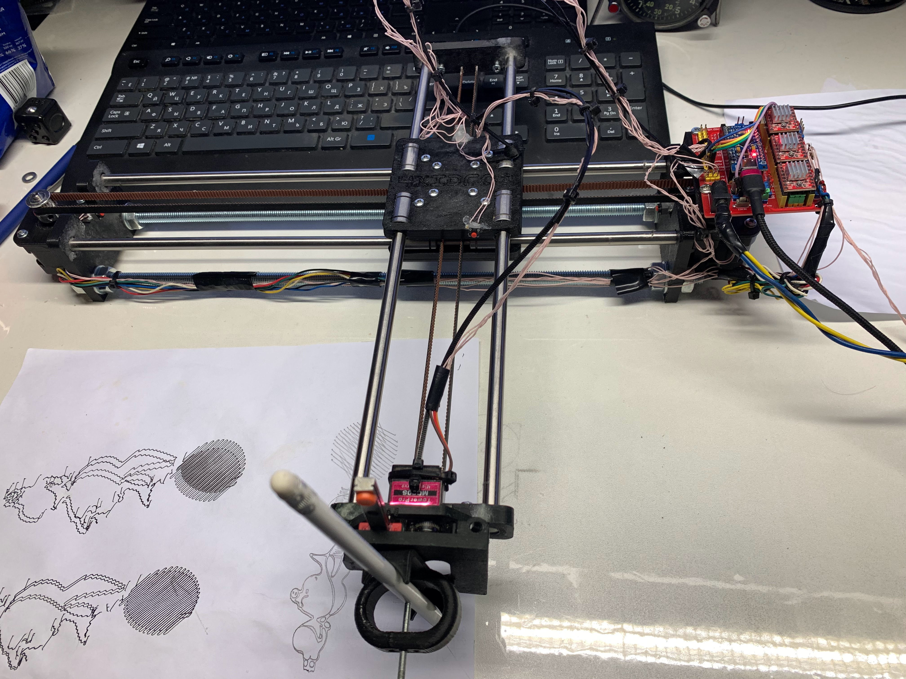
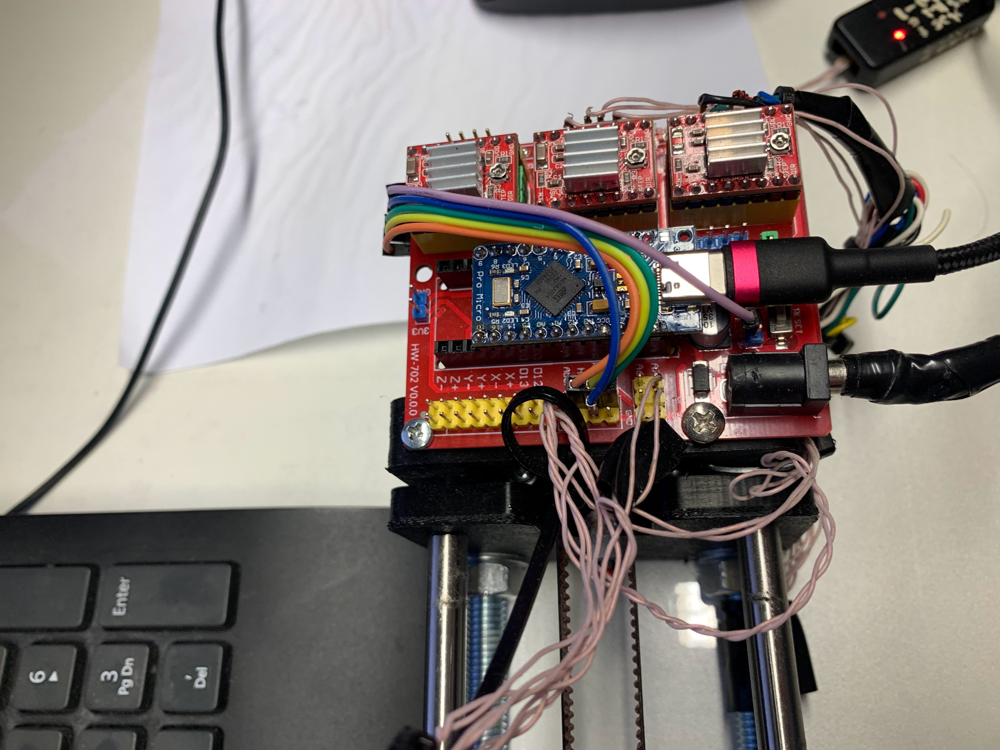
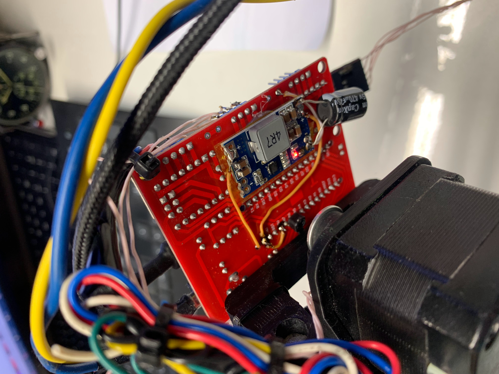

## Для 4xiDraw. 
# Версия с использованием ProMicro ATMega32U4 и USB стеком от LUFA.

Сборка под Win10.
Для сборки вызвать compile.cmd, НЕ ЗАБЫТЬ СОЗДАТЬ ПАПКУ ***obj***

Поскольку прошивка занимает около 90% памяти, то бутлодера здесь нет. 

Загружать напрямую через ICSP, используя программатор.

поскольку CNC шилд не имеет источника питания, пришлось добавить дополнительно 12-5В преобразователь

При использовании скрипта MI Inkscape Extension изображение получается зеркально отображеное, необходимо учитывать это или поправить 
скрипт - прошивку. 